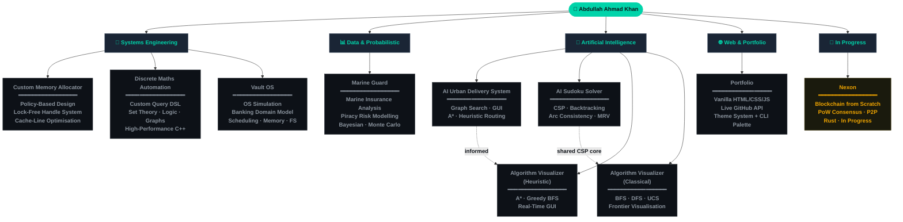

<div align="center">

<br/>

```
╔═══════════════════════════════════════════════════════════════════╗
║  SYSTEM BOOT  ·  INITIALISING DEVELOPER PROFILE  ·  v2.0.0       ║
╚═══════════════════════════════════════════════════════════════════╝
```

# Abdullah Ahmad Khan

**Systems Architect &nbsp;·&nbsp; Low-Level Developer &nbsp;·&nbsp; AI Builder**

[](https://git.io/typing-svg)

<br/>

[](https://Za-Coding-Paradox.github.io/Portofolio)&nbsp;
[](mailto:Abdullah.Ahmad.Khan.Professional@gmail.com)&nbsp;
[](https://github.com/Za-Coding-Paradox)

<br/>

&nbsp;
&nbsp;


</div>

<br/>

---

## `whoami`

I am a **systems-focused developer** and first-year Computer Science undergraduate at **NUCES — FAST**, Faisalabad. My work is built on a single conviction: understanding machines at their lowest level produces better software at every level above.

My projects span **custom memory allocators**, **OS simulation**, **AI search infrastructure**, **probabilistic risk modelling**, **blockchain engineering**, and **discrete mathematics automation** — all written with a relentless emphasis on correctness, efficiency, and architectural clarity.

> In my first semester alone, I earned a place on the **Dean's List** and finished **5th at Code Clash** — FAST's university-wide competitive programming competition — competing directly against students two and three years my senior.

<br/>

<div align="center">

| 🖥️ OS | 🐚 Shell | 📝 Editor | 🎯 Focus | 📍 Base |
|:---:|:---:|:---:|:---:|:---:|
| `Arch Linux x86_64` | `Zsh + Starship` | `Neovim` | Systems · AI | Faisalabad, PK |

</div>

<br/>

---

## `skill --profile`

<div align="center">

```
DOMAIN                    PROFICIENCY       TOOLS & CONCEPTS
─────────────────────────────────────────────────────────────────────
Systems & Memory          ████████████ 95%  C++, Memory Arenas, TLSF
Lock-Free Structures      ██████████── 85%  Atomics, CAS, Hazard Ptrs
Cache Optimisation        ██████████── 85%  Alignment, False Sharing
AI Search & Heuristics    ████████████ 90%  A*, CSP, Arc Consistency
Python Tooling            █████████─── 80%  PyGame, tkinter, numpy
Bash & Scripting          ████████──── 75%  Automation, Build Systems
Version Control           █████████─── 80%  Git, GitHub Actions
Debugging & Profiling     █████████─── 80%  GDB, Valgrind, Perf
─────────────────────────────────────────────────────────────────────
```

</div>

<br/>

### Languages

&nbsp;
&nbsp;
&nbsp;
&nbsp;
&nbsp;


### Environment

&nbsp;
&nbsp;
&nbsp;
&nbsp;
&nbsp;


<br/>

---

## `ls -la ./projects/`

<br/>

### 🔧 Systems Engineering

---

#### [`Custom-Memory-Allocator`](https://github.com/Za-Coding-Paradox/Custom-Memory-Allocator)

&nbsp;
&nbsp;
&nbsp;


A high-performance, **policy-based memory management module** designed for portability across game engine codebases. Implements a lock-free handle system and cache-line-optimised pool architecture with zero external dependencies.

```
Architecture at a glance:

  ┌──────────────────────────────────────────────────────────┐
  │  Allocation Policy  │  Memory Layout  │  Handle System   │
  │  (compile-time)     │  (cache-line    │  (indirection    │
  │                     │   aligned)      │   + compaction)  │
  └──────────────────────────────────────────────────────────┘
         │                     │                  │
         ▼                     ▼                  ▼
   Swap strategies       Eliminate false      Pointer safety
   without touching      sharing in SMP       without GC
   memory layout         contexts             overhead
```

**Key design decisions:**

- **Policy-based design** separates allocation strategy from memory layout — swap strategies at compile time, zero runtime cost
- **Cache-line alignment** eliminates false sharing across cores in multi-threaded contexts
- **Handle indirection** enables memory compaction without invalidating live pointers

---

#### [`Discrete-Maths-Automation-System`](https://github.com/Za-Coding-Paradox/Discrete-Maths-Automation-System)

&nbsp;
&nbsp;
&nbsp;


A **high-performance discrete mathematics engine** driven by a custom file-based query DSL. Handles complex mathematical computation — set theory, propositional logic, relations, and graph operations — through structured, scriptable input rather than interactive prompts.

**Supported domains:**

| Domain | Operations |
|:---|:---|
| Set Theory | Union, Intersection, Difference, Power Set, Cartesian Product |
| Logic | Truth Tables, CNF/DNF, Satisfiability, Tautology Checking |
| Relations | Reflexivity, Symmetry, Transitivity, Closure Computation |
| Graph Theory | Adjacency, Path Finding, Connectivity, Cycle Detection |

---

#### [`Vault-OS`](https://github.com/Za-Coding-Paradox/Vault-OS)

&nbsp;
&nbsp;
&nbsp;


A **simulated operating system** that models core OS concepts through the lens of a banking environment. Vault OS implements process scheduling, memory management, and file I/O — all mapped onto a banking domain where accounts are processes, transactions are syscalls, and the ledger is the filesystem.

```
OS Simulation Layer:

  ┌───────────────────────────────────────────────────────────┐
  │  Process Scheduler  │  Memory Manager  │  File System     │
  │  (accounts/users)   │  (balance arenas)│  (transaction    │
  │                     │                  │   ledger)        │
  └───────────────────────────────────────────────────────────┘
         │                     │                   │
         ▼                     ▼                   ▼
   Round-robin / priority   Arena isolation     Journalled I/O
   scheduling per user      per account         for atomicity
```

**What it simulates:**

| OS Concept | Banking Analogue |
|:---|:---|
| Process Scheduling | Multi-user account access & priority |
| Memory Arenas | Isolated per-account balance regions |
| Syscalls | Deposit, withdraw, transfer operations |
| File System | Persistent transaction ledger with journalling |
| Concurrency Control | Race-condition-safe balance updates |

---

### 📊 Data & Probabilistic Systems

---

#### [`Marine-Guard`](https://github.com/Za-Coding-Paradox/Marine-Guard)

&nbsp;
&nbsp;
&nbsp;


A **probability and statistics engine** for analysing marine insurance premium risk modelling in the context of pirate attack data. Ingests historical incident records, applies statistical inference and probability distributions, and produces actuarially-grounded premium estimates tied to route risk.

```
Analysis Pipeline:

  Pirate Attack   ──►  Distribution    ──►  Risk Score   ──►  Premium
  Dataset              Fitting               per Route         Model
  (historical)         (Poisson / NB)        (Bayesian         (output)
                                             updating)
```

**Statistical techniques:**

| Method | Application |
|:---|:---|
| Poisson / Negative Binomial Fit | Attack frequency modelling per sea region |
| Bayesian Updating | Prior beliefs revised with new incident data |
| Monte Carlo Simulation | Premium uncertainty bounds under attack scenarios |
| Regression Analysis | Premium sensitivity to route, season, vessel type |
| Descriptive Statistics | Hotspot identification, temporal trend analysis |

<br/>

### 🤖 Artificial Intelligence

---

#### [`AI-Urban-Delivery-System`](https://github.com/Za-Coding-Paradox/AI-Urban-Delivery-System)

&nbsp;
&nbsp;


A **GUI-based urban delivery optimiser** using AI search strategies to route packages across a simulated city graph. Renders the frontier expansion and final path in real time — making the decision logic transparent and inspectable rather than a black box.

```
Search Pipeline:

  City Graph ──► Heuristic fn ──► Priority Queue ──► Path ──► GUI Render
                  (Euclidean                          ↑
                   distance)       Expand node ───────┘
                                   Update costs
```

---

#### [`AI-Sudoku-Solver`](https://github.com/Za-Coding-Paradox/AI-Sudoku-Solver)

&nbsp;


A **console-based Sudoku solver** implementing full Constraint Satisfaction Problem mechanics — arc consistency propagation, backtracking with forward checking, and Minimum Remaining Value (MRV) heuristics.

**CSP technique stack:**

```
AC-3 Arc Consistency  ──►  MRV Variable Selection  ──►  Backtracking
(domain pruning)            (least-constrained last)      (+ forward check)
```

---

#### [`AI-Algorithm-Visualizer — Heuristic`](https://github.com/Za-Coding-Paradox/AI-Algorithm-Visualizer-Heuristic-Approach)

&nbsp;


Interactive GUI visualiser for **heuristic search algorithms**: A\*, Greedy Best-First, and weighted variants. Renders the open frontier, visited nodes, and optimal path in real time on an interactive grid.

---

#### [`AI-Algorithm-Visualizer — Classical`](https://github.com/Za-Coding-Paradox/AI-Algorithm-Visualizer-Classical-Approach)

&nbsp;


Interactive GUI visualiser for **uninformed search algorithms**: BFS, DFS, and Uniform Cost Search — demonstrating the structural and performance differences between exploration strategies visually.

<br/>

### 🌐 Web & Portfolio

---

#### [`Portfolio`](https://Za-Coding-Paradox.github.io/Portofolio)

&nbsp;
&nbsp;
&nbsp;


Personal developer portfolio featuring a three-mode theme system (Dark / Light / Terminal), a `Ctrl+K` command palette, live GitHub dashboard, canvas starfield, and scroll-reveal animations. Built in pure HTML, CSS, and vanilla JavaScript — no frameworks, no build step, no dependencies.

<br/>

---

## `git log --projects --in-progress`

<div align="center">

| Project | Description | Stack | Status |
|:---:|:---|:---:|:---:|
| **Nexon** | A blockchain implementation written from scratch in Rust. Implements a full peer-to-peer ledger with proof-of-work consensus, block validation, transaction signing, and a custom networking layer — no framework, no shortcuts. | `Rust` | 🟡 Active |

</div>

<br/>

---

## `cat achievements.log`

<div align="center">

| # | Achievement | Detail | Institution |
|:---:|:---|:---|:---:|
| 🏅 | **Dean's List** | Top academic standing — Semester 1 | NUCES — FAST |
| 🥇 | **5th Place — Code Clash** | University-wide competitive programming, competing vs 2nd–4th year students in first semester | NUCES — FAST |
| 📂 | **7 Public Repositories** | Active projects across systems, AI, and the web | GitHub |

</div>

> **Note on Code Clash:** Placed 5th out of all year groups — competing directly against students in their 2nd, 3rd, and 4th years — during my first semester of university.

<br/>

---

## `dot --graph ./architecture`

*How my projects relate across the systems stack.*



<br/>

---

## `gh stats --user Za-Coding-Paradox`

<div align="center">

&nbsp;&nbsp;

<br/><br/>

[](https://git.io/streak-stats)

<br/><br/>

[](https://github.com/ashutosh00710/github-readme-activity-graph)

</div>

<br/>

---

## `wakatime --summary`

<div align="center">

> *Weekly coding activity — tracked across all active sessions.*

<!--START_SECTION:waka-->

```text
C++          ██████████████████░░░   72.4%
Python       ████░░░░░░░░░░░░░░░░░   17.8%
Bash         █░░░░░░░░░░░░░░░░░░░░    5.1%
Markdown     ░░░░░░░░░░░░░░░░░░░░░    2.8%
Other        ░░░░░░░░░░░░░░░░░░░░░    1.9%
```

<!--END_SECTION:waka-->

</div>

<br/>

---

## `finger --contact`

<div align="center">

Open to **internships**, **research collaborations**, **project work**, and any opportunity that requires building software from first principles — in systems programming, AI infrastructure, or anything where correctness matters more than convenience.

<br/>

[](mailto:Abdullah.Ahmad.Khan.Professional@gmail.com)&nbsp;
[](mailto:zacodingparadox@gmail.com)&nbsp;
[](https://Za-Coding-Paradox.github.io/Portofolio)

<br/>

```
┌─────────────────────────────────────────────────────────────────┐
│  Response time: < 24h  ·  Time zone: PKT (UTC+5)                │
│  Preferred: Work email for professional enquiries               │
└─────────────────────────────────────────────────────────────────┘
```

</div>

<br/>

---

<div align="center">

*If something here was useful — leave a star.* ⭐

<br/>


</div>
