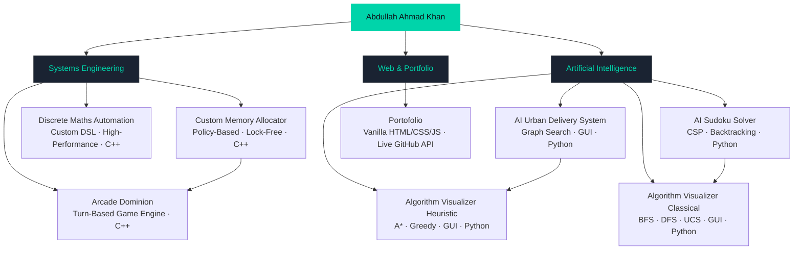

 

# Abdullah Ahmad Khan

### Systems Architect &nbsp;·&nbsp; Low-Level Developer &nbsp;·&nbsp; AI Builder

 

&nbsp;
&nbsp;

&nbsp;

---

## 👤 About Me

I am a **systems-focused developer** and first-year Computer Science undergraduate based in **Faisalabad, Punjab, Pakistan**. My passion lies in understanding machines at their lowest level — I build software from first principles rather than leaning on abstractions.

My work spans **custom memory allocators**, **AI language model infrastructure**, **pathfinding visualisation engines**, and **discrete mathematics automation** — all built with a relentless focus on correctness, efficiency, and architectural clarity.

In my **first semester alone**, I earned a place on the **Dean's List** and finished **5th at Code Clash** — FCAPS's university-wide competitive programming competition — competing directly against students two and three years my senior.

I currently operate at the intersection of **low-level systems engineering** and **AI runtime architecture**, building tools that are not just functional, but *demonstrably efficient*.

 

| 🖥️ OS | 🐚 Shell | 📝 Editor | 🎯 Focus | 📍 Location |
|:---:|:---:|:---:|:---:|:---:|
| Arch Linux x86_64 | Zsh + Starship | Neovim | Systems · AI | Faisalabad, Pakistan |

---

## 🛠️ Technical Skills

### Systems & Low-Level Engineering

&nbsp;
&nbsp;
&nbsp;
&nbsp;

### Artificial Intelligence & Algorithms

&nbsp;
&nbsp;
&nbsp;
-0d1117?style=for-the-badge&logoColor=00d4aa)

### Toolchain & Environment

&nbsp;
&nbsp;
&nbsp;
&nbsp;
&nbsp;

---

## 📁 Projects

### 🔧 Systems Engineering

#### [Custom-Memory-Allocator](https://github.com/Za-Coding-Paradox/Custom-Memory-Allocator)

&nbsp;
&nbsp;

A high-performance, **policy-based memory management module** designed for portability. Implements a lock-free handle system and cache-line-optimised pool architecture. Built to be dropped directly into any under-development game engine with minimal integration overhead.

**Key design decisions:**
- Policy-based design separates allocation strategy from memory layout
- Cache-line alignment eliminates false sharing in multi-threaded contexts
- Handle indirection allows compaction without pointer invalidation

---

#### [Discrete-Maths-Automation-System](https://github.com/Za-Coding-Paradox/Discrete-Maths-Automation-System)

&nbsp;
&nbsp;

A **high-performance discrete mathematics engine** that accepts a custom file-based query DSL. Manages complex mathematical computing — set theory, logic, relations, and graph operations — through structured, scriptable input files rather than interactive prompts.

---

#### [Arcade-Dominion](https://github.com/Za-Coding-Paradox/Arcade-Dominion) *(Private)*

&nbsp;

A **turn-based game** inspired by Pokémon but built with an original indie twist. Focuses on tight game-loop architecture and clean entity management in C++ without relying on an external engine.

---

### 🤖 Artificial Intelligence

#### [AI-Urban-Delivery-System](https://github.com/Za-Coding-Paradox/AI-Urban-Delivery-System)

&nbsp;
&nbsp;

A **GUI-based urban delivery optimiser** using AI search strategies to route packages across a simulated city graph. Visualises the search process in real time, making the decision logic transparent and inspectable.

---

#### [AI-Sudoku-Solver](https://github.com/Za-Coding-Paradox/AI-Sudoku-Solver)

&nbsp;
&nbsp;

A **console-based Sudoku solver** implementing Constraint Satisfaction Problem mechanics — arc consistency, backtracking with forward checking, and MRV heuristics — to solve any valid Sudoku puzzle efficiently.

---

#### [AI-Algorithm-Visualizer — Heuristic Approach](https://github.com/Za-Coding-Paradox/AI-Algorithm-Visualizer-Heuristic-Approach)

&nbsp;

An **interactive GUI visualiser** for heuristic search algorithms including A\*, Greedy Best-First, and weighted variants. Renders the frontier, visited nodes, and final path in real time on a grid.

---

#### [AI-Algorithm-Visualizer — Classical Approach](https://github.com/Za-Coding-Paradox/AI-Algorithm-Visualizer-Classical-Approach)

&nbsp;

An **interactive GUI visualiser** for classical (uninformed) search algorithms — BFS, DFS, and Uniform Cost Search — demonstrating the structural differences between breadth-first and depth-first exploration visually.

---

### 🌐 Web & Other

#### [Portofolio](https://github.com/Za-Coding-Paradox/Portofolio)

&nbsp;
&nbsp;
&nbsp;

Personal **developer portfolio** featuring a three-mode theme system (Dark / Light / Terminal), a `Ctrl+K` command palette, a live GitHub dashboard, canvas starfield, and scroll-reveal animations. Built in pure HTML, CSS, and vanilla JavaScript — no frameworks, no build step.

---

## 🏆 Achievements

| Award | Detail | Institution |
|:---:|:---:|:---:|
| 🏅 **Dean's List** | Semester 1 — Top academic standing | NUCES -- FAST |
| 🥇 **5th Place — Code Clash** | University-wide competitive programming | NUCES -- FAST |
| 📂 **7 Public Repositories** | Across systems, AI, and algorithms | GitHub |

> Placed **5th out of all year groups** in Code Clash, competing directly against students in their 2nd, 3rd, and 4th years — in the first semester of university.

---

## 🗺️ Architecture Overview

*How my projects relate to one another across the systems stack.*

---

## 🔭 Currently Building

| Project | Description | Stack | Status |
|:---:|:---:|:---:|:---:|
| **AuraLM** | Language model runtime with context isolation. Each inference session runs in a sandboxed memory arena. | `C++` | 🟡 In Progress |
| **Arcade-Dominion** | Turn-based indie game with Pokémon-inspired mechanics and a distinctive original twist. | `C++` | 🟡 In Progress |

---

## 📊 GitHub Statistics

&nbsp;&nbsp;

  

  

---

## 📬 Contact

I am open to internships, collaborations, research opportunities, and project work in systems programming, AI infrastructure, or anything that requires building from first principles.

 

&nbsp;
&nbsp;

📍 Faisalabad, Punjab, Pakistan

---

*If something here was useful to you — leave a star.* ⭐

